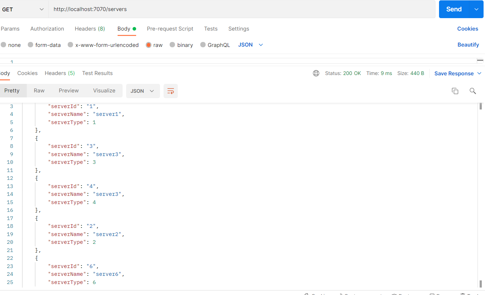
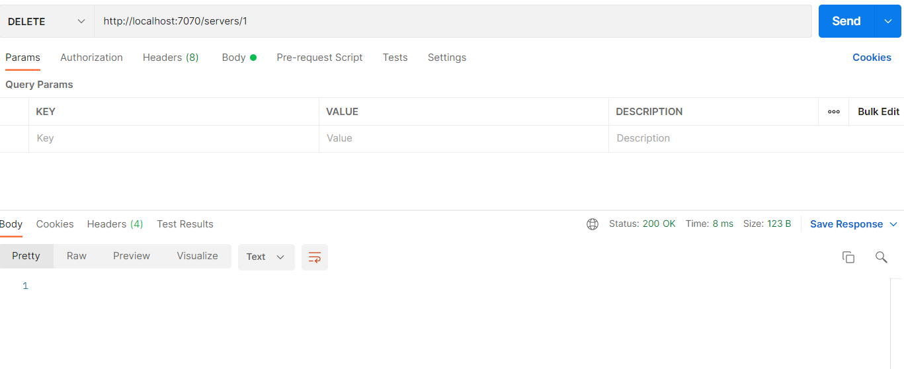
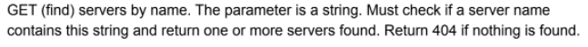
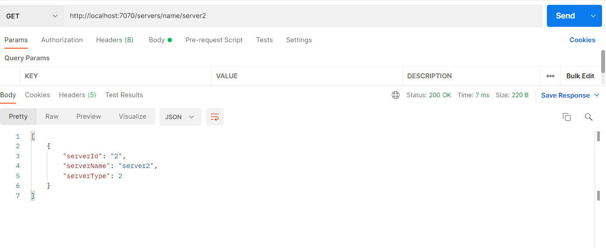

# restApi-task1-

## Get {all and byId}

Get all servers when no parameter passed:

Get server when id passed as parameter:

## Put

Adding server with json encoded body:

request to put

Changes reflected when get all servers called again-

## Delete{byId}

Request to delete for id “1”:

Changes reflected when get all servers called again:

## Get {byName}

Request to get server with server name “server2” (ONLY ONE SV EXISTS):

Request to get server with server name “server3” (MULTIPLE SV EXISTS):

ide-STS , apiTesting-Postman